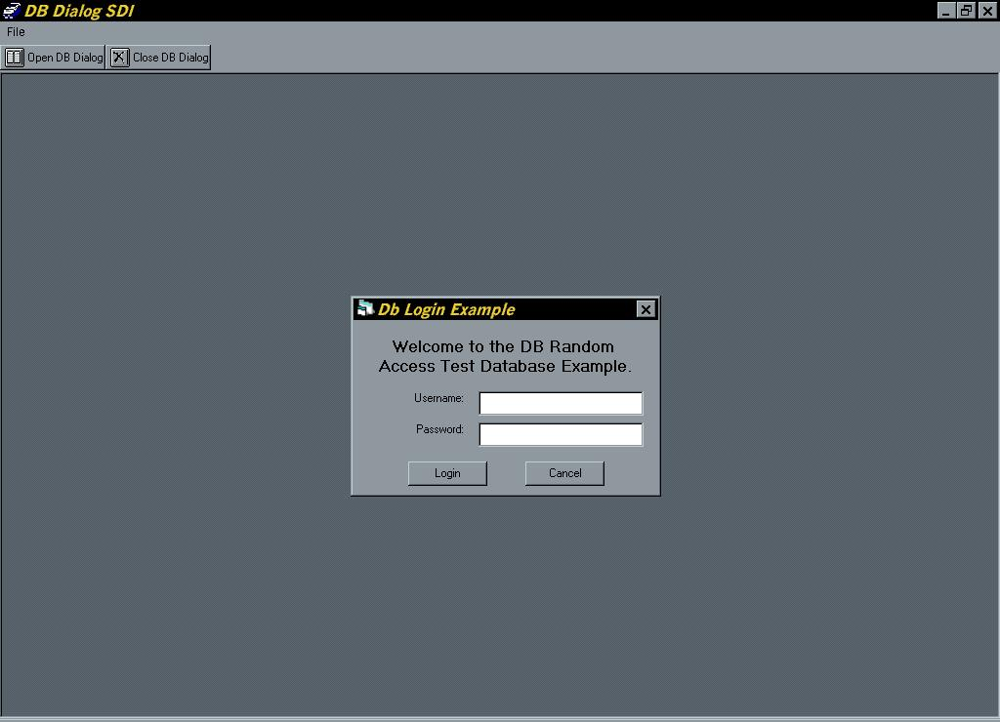



## \[An improved version\] of my previous Random File Access Program

### Description

Beta V1.0.4 of my Random Access File program. By no means is this a complete app; however, it now has the look and feel of an Access environment...MDI look-and-feel (just the beginnings). Adding more validation routines, login prompt (which uses reads from an ini/config file), toolbars, menubars, progressbar and search function. Great for beginners and may help some intermediates. No ODBC or ODBC-bridge needed. Just a simple text file using the age-old Random Access. Again, this is not a complete app. If you like it, please vote and leave comments.
 
### More Info
 

             |
---                |---
**Submitted On**   |2004-04-02 14:19:04
**By**             |[Steven Jacobs](https://github.com/Planet-Source-Code/PSCIndex/blob/master/ByAuthor/steven-jacobs.md)
**Level**          |Intermediate
**User Rating**    |4.8 (19 globes from 4 users)
**Compatibility**  |VB 4\.0 \(32\-bit\), VB 5\.0, VB 6\.0
**Category**       |[Files/ File Controls/ Input/ Output](https://github.com/Planet-Source-Code/PSCIndex/blob/master/ByCategory/files-file-controls-input-output__1-3.md)
**World**          |[Visual Basic](https://github.com/Planet-Source-Code/PSCIndex/blob/master/ByWorld/visual-basic.md)
**Archive File**   |[\[An\_improv172762422004\.zip](https://github.com/Planet-Source-Code/steven-jacobs-an-improved-version-of-my-previous-random-file-access-program__1-52802/archive/master.zip)

